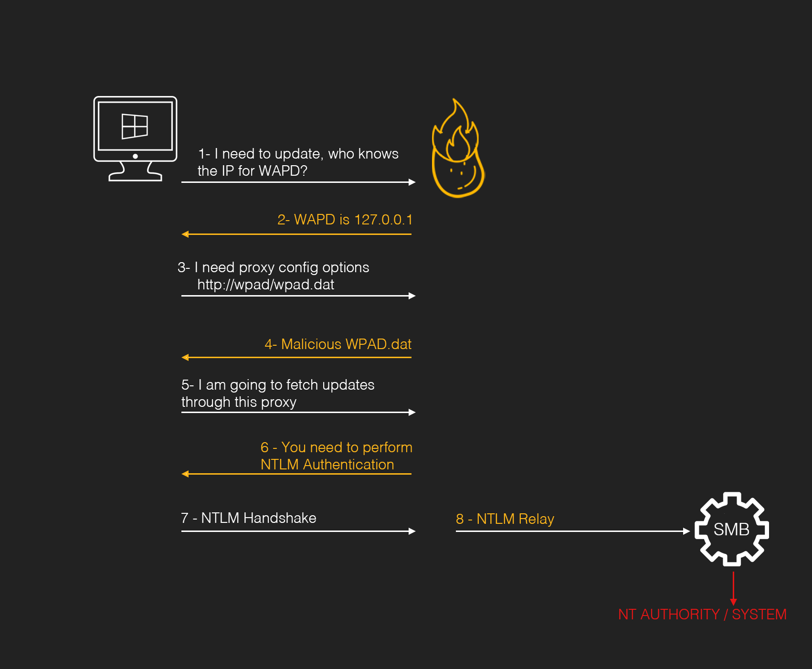
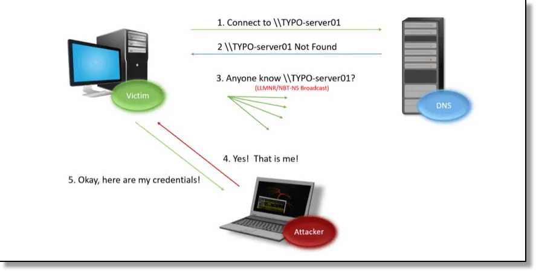

# Hot Potato

Hot Potato là potato đầu tiên và được đặt tên bởi người phát hiện ra nó Stephen Breen @breenmachine. Lỗ hổng này có ảnh hưởng đến Windows 7, 8, 10 và Windows Server 2008 và Server 2012.

Tổng quan, Hot Potato được chia làm 3 phần chính, tất cả đều có thể sử dụng dòng lệnh để cấu hình. Hơn thế, mỗi phần đều là các kĩ thuât đã được biết đến và được sử dụng trong khoảng thời gian dài, thậm chí cho đến hiện tại (2023).

1. Local NBNS Spoofer: Attacker mạo danh tên phân giải từ địa chỉ IP để khiến cho Victim tải file cấu hình WAPD độc hại.

   1.1. NBNS (WINS) (port 137) (NetBIOS Name Service)

   - NBNS là giao thức quảng bá (broadcast) hoạt động trên nền UPD phục vụ viện phân giải tên, thường được sử dụng trong môi trường Windows.
   - Khi thực hiện một DNS lookup:

     - Trước tiên, Windows sẽ kiểm tra file "hosts" trong "C:\Windows\System32\drivers\etc".
     - Nếu không có, Windows thực hiện DNS lookup để tìm.
     - Nếu không thể tìm thấy, Windows sẽ thực hiện NBNS lookup. Giao thức NBNS sẽ hỏi tất cả các host có trong mạng nội bộ bằng cách truyền Broadcast "Who knows the IP address for host XXX?". Bất kể một host nào trong mạng đều có thể tự do trả lời gói tin này.

   1.2. Usage in Hot Potato:

   - Lợi dụng điểm yếu của NBNS khi tất cả các host đều có thể trả lời gói tin broadcast hỏi địa chỉ, Attacker có thể đánh lừa hệ thống của Victim rằng Attacker chính là nơi mà Victim đang tìm.
     
   - 

2. Fake WPAD Proxy Server: Attacker triển khai file cấu hình WAPD độc hại để buộc Victim phải thực hiện xác thực NTLM.
3. HTTP -> SMB NTLM Relay: Attacker sử dụng WPAD NTML token để truy cập SMB và tạo ra tiển trình có đặc quyền.
